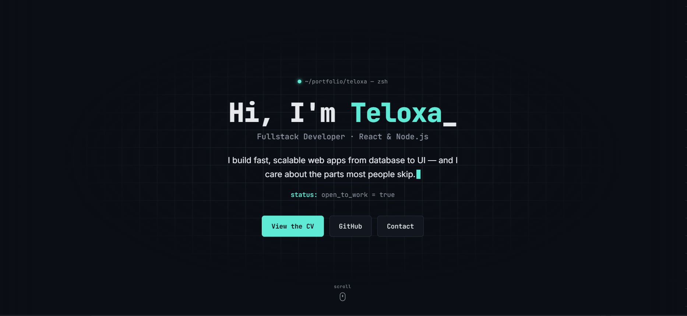

# Hi, I'm Teloxa 

Computer Systems Engineering student building software with a focus on 
maintainability, clear architecture, and solving real problems.

### 🔍 How I work.
- **Debug at the source** — I trace issues to root cause instead of patching symptoms.
- **Ship in sprints** — Comfortable with Scrum: standups, backlog grooming, story pointing, retros.
- **Design before I build** — I think in patterns and trade-offs (SOLID, separation of concerns) before writing code that's hard to extend later.

##  Tech Stack

### Languages 

  

### Frontend

  

### Backend & Tools

  

 

  

 

  

